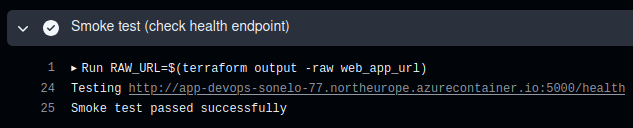

# Serverless Ephemeral Infrastructure and Automated CD with Terraform

[](https://github.com/kindel-devops-lab/azure-infra-terraform/actions/workflows/cd.yml)

Declarative Infrastructure as Code (IaC) managing ephemeral container deployments, zero long-lived credentials via OpenID Connect (OIDC), and automated validation on Microsoft Azure.

---

## Architectural Overview

This repository implements automated lifecycle management for a containerized microservice running on Microsoft Azure. 

The infrastructure adopts a cost-optimized, serverless deployment pattern using Azure Container Instances (ACI). Instead of maintaining persistent Virtual Machines or dedicated Kubernetes nodes, the environment provisions on demand, validates application availability via smoke tests, and tears down resources to enforce strict FinOps constraints.

<!-- PLACEHOLDER: Insert Cloud Architecture Diagram here -->
<!-- File: docs/images/infrastructure(light).png or docs/images/infrastructure(dark).png -->
.png)

### Key Architectural Characteristics

* Cloud Provider: Microsoft Azure (Region: North Europe).
* Infrastructure as Code: Terraform with azurerm provider (~> 3.90.0).
* Compute Architecture: Azure Container Instances (ACI) allocating 0.5 vCPU and 1.0 GB memory per ephemeral instance.
* Image Delivery: Private pulls from Azure Container Registry (ACR) authenticated through native service credentials.
* Identity Federation: Short-lived token exchange via Microsoft Entra ID OpenID Connect (OIDC), eliminating static subscription keys and secrets.
* State Locking and Consistency: Azure Blob Storage backend utilizing native lease lock mechanisms to prevent concurrent plan or apply corruption.

---

## Continuous Deployment Lifecycle

Deployment is governed by GitHub Actions, executing declarative checks, environment approvals, automated provisioning, smoke testing, and resource destruction.

<!-- PLACEHOLDER: Insert GitHub Actions CD Workflow Screenshot here -->
<!-- File: docs/images/cd.png -->


### Pipeline Stages

1. Terraform Initialization: Configures the remote Azure Blob Storage backend, downloads provider plugins, and acquires the state lease.
2. Speculative Execution (Plan): Computes the differential change matrix between committed HCL code and active cloud state.
3. Automated Provisioning (Apply): Deploys the isolated Resource Group, registers the private ACR binding, and spins up the ACI container group.
4. Endpoint Smoke Testing: Performs iterative HTTP GET probing against the public FQDN (/health) until standard response payload confirms operational status.
5. Ephemeral Teardown (Destroy): Systematically destroys provisioned ACI compute and associated dynamic resources to maintain a zero-cost footprint outside of test windows.

<!-- PLACEHOLDER: Insert Smoke Test Console Output Screenshot here -->
<!-- File: docs/images/smoke-test-output.png -->


---

## Repository Structure

```text
.
├── .github/
│   └── workflows/
│       └── cd.yml              # Ephemeral deployment and validation pipeline
├── docs/
│   └── images/                 # Architecture diagrams and validation evidence
├── main.tf                     # Core resource declarations (RG, ACR, ACI)
├── variables.tf                # Input variable definitions and type constraints
├── terraform.tfvars            # Deployment values and automated GitOps image tags
├── outputs.tf                  # Exposed endpoints, FQDNs, and resource identifiers
└── versions.tf                 # Terraform core version and provider constraints
```
### Local Execution and Verification

# Prerequisites
* Terraform >= 1.6.0
* Azure CLI (az)
* Active Azure Subscription

## 1. Authenticate with Azure

```bash
az login
az account set --subscription "<SUBSCRIPTION_ID>"
```

## 2. Initialize Remote State Backend

Ensure environment variables for storage authentication are exported, then initialize:

```bash
terraform init
```

## 3. Review Plan Matrix

```bash
terraform plan -out=tfplan
```

## 4. Deploy and Validate Workload

Apply the generated plan:

```bash
terraform apply tfplan
```

Extract the dynamically assigned public endpoint:

```bash
terraform output -raw web_app_url
```

Execute an operational check against the public FQDN:

```bash
curl -f "$(terraform output -raw web_app_url):5000/health"
```

## 5. Destroy Ephemeral Resources

```bash
terraform destroy -auto-approve
```
